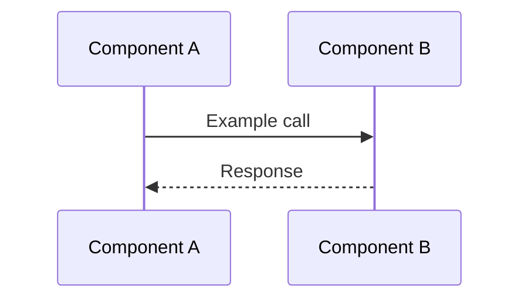

# Design Doc Writing Skill

Use this skill when asked to author or restyle design documents. The goal is to produce a consistent, high-quality doc that matches AirSync design doc structure.

## Core structure

1. **Title + short summary**
   - Title at the top.
   - One paragraph describing the document’s scope.

2. **Glossary**
   - Define domain-specific terms and acronyms used throughout the doc.

3. **Problem Statement**
   - Explain the current pain points and why the feature is needed.

4. **Goals**
   - Bullet list of user/system outcomes.

5. **Non-Goals**
   - Explicitly list items that are out of scope.

6. **Proposed Design**
   - High-level approach.
   - Include **Features** as numbered subsections, each with **Success metrics**.

7. **Scenarios (with mermaid diagrams)**
   - Enumerate key scenarios (happy-path and failure-path).
   - Use **mermaid sequence diagrams** for flows.

8. **Lifecycle (with mermaid diagrams)**
   - Use **mermaid flowcharts** to describe lifecycle/state changes.

9. **Architecture**
   - Describe major components, data schemas, indexes, and API/interface changes.

10. **Failure Scenarios**
    - Document key failure modes and how the system responds.

11. **Testing Strategy**
    - Cover unit, integration, and end-to-end testing.

12. **Performance and Scalability**
    - Describe constraints, limits, and operational impact.

13. **Possible Future Improvements**
    - List plausible follow-on work or phase-2 ideas.

14. **Open Questions**
    - Track unresolved decisions or pending inputs.

## Mermaid diagram conventions

- Prefer inline mermaid blocks in the Markdown document.
- Keep diagrams small and scoped to a single scenario.

Example:

## Writing style

- Use consistent terminology from the glossary.
- Prefer clear, direct language over speculative phrasing.
- Ask questions when requirements are unclear or edge cases haven’t been discussed.
